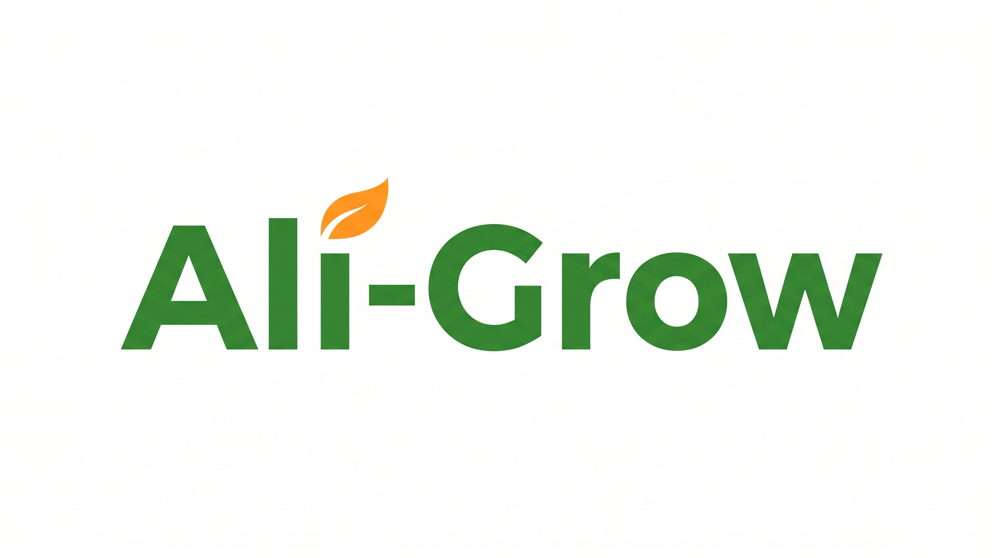

# Project 1: Agricultural Market Price Transparency In Kenyan Markets

## ALi-Grow

## Problem Statement
Farmers in Kenya receive 30-40% lower prices for their crops because they lack real-time market information. Middlemen exploit this information asymmetry, buying at low prices and selling at high margins.

## Who Benefits
- **Smallholder farmers** - Get fair prices by knowing market rates
- **Cooperatives** - Can negotiate better deals with bulk information
- **Consumers** - Can find the best prices for food
- **Economy** - Reduces food waste and improves food security

## Learning Objectives
By completing this project, you will learn:
1. **Python** - Backend API development with Flask
2. **SQL** - Database design and queries
3. **HTML/CSS** - Web interface design
4. **REST APIs** - How frontend and backend communicate
5. **CRUD operations** - Create, Read, Update, Delete data

## Tech Stack
- **Backend:** Python + Flask
- **Database:** SQLite (simple, no setup needed)
- **Frontend:** HTML + CSS + JavaScript
- **Deployment:** Railway (free tier)

---

## Phase 1: Understanding the Problem

### Real-World Context
In Kenya, a farmer in Nakuru might grow tomatoes but not know that prices in Nairobi's Wakulima Market are 50% higher than at the local market. Without transportation info or market data, they sell to middlemen.

### Existing Solutions
- **Twiga Foods** - B2B platform for fresh produce (limited to large buyers)
- **iProcure** - Agricultural input supply chain (doesn't cover price data)
- **Government markets** - Physical notice boards (outdated, localized)

### Our Gap
No simple, accessible platform showing real-time prices across multiple markets for different crops.

---

## Phase 2: Planning the Solution

### MVP Features
1. Display current prices for different crops
2. Show prices by market location
3. Allow adding new price entries
4. Filter by crop type or market
5. Responsive design for mobile use
